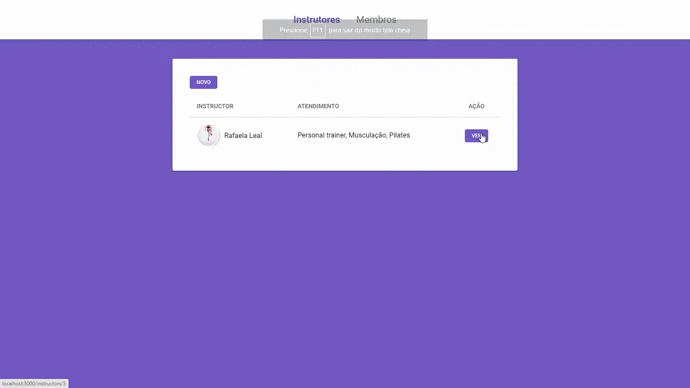

# PROJETO **GYM**

<h1 alig="center">
    
</h1>


# Indice
- [Sobre](#-sobre)
- [Tecnologias Utilizadas](#-Tecnologias-utilizadas)
- [Como baixar o projeto](#-Como-baixar-o-projeto)

---

## 🔖Sobre
Projeto **GYM** de gerenciamento de cadastro de **Membros** e **Instrutores** de academia - projeto tem como propozito por os conhceimentos adiquiridos em pratica.

---
## 💻 Tecnologias utilizadas
O Projeto foi desenvolvido utilizando as seguintes tecnologias.

- [JavaScript](https://www.javascript.com/)
- [CSS](https://developer.mozilla.org/pt-BR/docs/Web/CSS)
- [Nunjucks](https://www.npmjs.com/package/nunjucks)

---

## 📂 Como baixar o projeto

```bash
    # Clonar o repositorio
    $ git clone https://github.com/italodaniel/Gym.git

    # Entra no diretório
    $ cd Gym

    # instalar as dependências
    $ npm install

    # Iníciar o projeto
    $ npm start
```
---
Desenvolvido 😎 por Daniel italo

Me siga - Meu [Instagram](https://www.instagram.com/daniel_itallo/)

